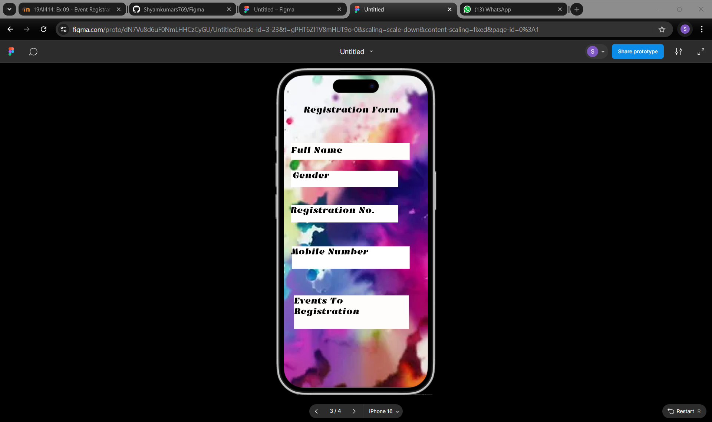

# Ex09 Event Registration Web Application
## Date:20-12-2024

## AIM:
To design, develop and deploy a web application for event registration.

## DESIGN STEPS:

### Step 1:
Create a new frame.

### Step 2:
Select any one preset size of your choice.

### Step 3:
Select the shapes you need.

### Step 4:
Import images as needed.

### Step 5:
Create pages based on your need and link them.

### Step 6:

Validate the HTML and CSS code.

### Step 6:

Publish the website in the given URL.

## DESIGN TOOL:
Figma

## CODE:

```
page 1

<style>
.event-container {
  background-color: rgba(212, 183, 37, 0.51);
  display: flex;
  max-width: 480px;
  width: 100%;
  flex-direction: column;
  overflow: hidden;
  color: rgba(0, 0, 0, 1);
  margin: 0 auto;
  font: 400 24px DynaPuff, sans-serif;
}

.event-content {
  display: flex;
  flex-direction: column;
  position: relative;
  aspect-ratio: 0.461;
  width: 100%;
  align-items: center;
  padding: 48px 21px;
}

.background-image {
  position: absolute;
  inset: 0;
  height: 100%;
  width: 100%;
  object-fit: cover;
  object-position: center;
}

.header-logo {
  aspect-ratio: 4.67;
  object-fit: contain;
  object-position: center;
  width: 100%;
  align-self: stretch;
}

.event-logo {
  aspect-ratio: 0.93;
  object-fit: contain;
  object-position: center;
  width: 187px;
  margin-top: 91px;
  max-width: 100%;
}

.event-title {
  position: relative;
  margin-top: 23px;
}

.register-button {
  position: relative;
  background-color: rgba(51, 137, 250, 0.69);
  margin-top: 113px;
  width: 217px;
  max-width: 100%;
  font-family: Emblema One, sans-serif;
  padding: 15px 10px 29px;
  cursor: pointer;
  border: none;
  text-align: center;
  color: inherit;
}

.event-tagline {
  position: relative;
  font-size: 20px;
  margin-top: 155px;
}

.visually-hidden {
  position: absolute;
  width: 1px;
  height: 1px;
  padding: 0;
  margin: -1px;
  overflow: hidden;
  clip: rect(0, 0, 0, 0);
  border: 0;
}
</style>

<div class="event-container">
  <div class="event-content">
    
    
    
    <h1 class="event-title">Fusion Fiesta 2024</h1>
    <button class="register-button" tabindex="0">REGISTER NOW</button>
    <p class="event-tagline">"Creative Synergy"</p>
  </div>
</div>

page 2

<style>
.fiesta-events-container {
  background-color: #fff;
  display: flex;
  max-width: 480px;
  width: 100%;
  flex-direction: column;
  overflow: hidden;
  color: #000;
  margin: 0 auto;
  font: 400 20px Emblema One, sans-serif;
}

.events-wrapper {
  display: flex;
  flex-direction: column;
  position: relative;
  aspect-ratio: 0.461;
  width: 100%;
  align-items: start;
  padding: 82px 27px 304px;
}

.background-image {
  position: absolute;
  inset: 0;
  height: 100%;
  width: 100%;
  object-fit: cover;
  object-position: center;
}

.event-title {
  position: relative;
  font-size: 24px;
  align-self: center;
}

.event-item {
  position: relative;
}

.event-item-primary {
  align-self: stretch;
  margin-top: 117px;
}

.event-item-secondary {
  margin-top: 51px;
}

.event-item-tertiary {
  margin-top: 50px;
}

.event-item-quaternary {
  margin-top: 55px;
}

.event-item-quinary {
  margin: 71px 0 -61px;
}

.visually-hidden {
  position: absolute;
  width: 1px;
  height: 1px;
  padding: 0;
  margin: -1px;
  overflow: hidden;
  clip: rect(0, 0, 0, 0);
  border: 0;
}
</style>

<div class="fiesta-events-container">
  <div class="events-wrapper">
    
    <h1 class="event-title">Fiesta Events</h1>
    <div class="event-item event-item-primary" tabindex="0">Augmented Reality Art Show</div>
    <div class="event-item event-item-secondary" tabindex="0">Human Library Experience</div>
    <div class="event-item event-item-tertiary" tabindex="0">Glow in the Dark Dance Battle</div>
    <div class="event-item event-item-quaternary" tabindex="0">Escape the Maze Live</div>
    <div class="event-item event-item-quinary" tabindex="0">Silent Disco Zone</div>
  </div>
</div>

page 3

<style>
  .registration-container {
    background-color: rgba(255, 255, 255, 1);
    display: flex;
    max-width: 480px;
    width: 100%;
    flex-direction: column;
    overflow: hidden;
    color: rgba(0, 0, 0, 1);
    margin: 0 auto;
    font: 400 24px Emblema One, sans-serif;
  }
  .registration-wrapper {
    display: flex;
    flex-direction: column;
    position: relative;
    aspect-ratio: 0.461;
    width: 100%;
    padding: 80px 50px 160px 20px;
  }
  .background-image {
    position: absolute;
    inset: 0;
    height: 100%;
    width: 100%;
    object-fit: cover;
    object-position: center;
  }
  .form-title {
    position: relative;
    align-self: center;
  }
  .form-field {
    position: relative;
    background-color: rgba(255, 252, 252, 1);
    margin: 30px 0;
    padding: 5px 0 25px;
    width: 100%;
    max-width: 321px;
  }
  .visually-hidden {
    position: absolute;
    width: 1px;
    height: 1px;
    padding: 0;
    margin: -1px;
    overflow: hidden;
    clip: rect(0, 0, 0, 0);
    border: 0;
  }
</style>

<div class="registration-container">
  <form class="registration-wrapper">
    
    <h1 class="form-title">Registration Form</h1>
    
    <div class="form-field">
      <label for="fullName" class="visually-hidden">Full Name</label>
      <input type="text" id="fullName" name="fullName" aria-label="Full Name" required />
    </div>

    <div class="form-field">
      <label for="gender" class="visually-hidden">Gender</label>
      <select id="gender" name="gender" aria-label="Gender" required>
        <option value="">Select Gender</option>
        <option value="male">Male</option>
        <option value="female">Female</option>
        <option value="other">Other</option>
      </select>
    </div>

    <div class="form-field">
      <label for="regNo" class="visually-hidden">Registration Number</label>
      <input type="text" id="regNo" name="regNo" aria-label="Registration Number" required />
    </div>

    <div class="form-field">
      <label for="mobile" class="visually-hidden">Mobile Number</label>
      <input type="tel" id="mobile" name="mobile" aria-label="Mobile Number" required />
    </div>

    <div class="form-field">
      <label for="events" class="visually-hidden">Events To Registration</label>
      <select id="events" name="events" aria-label="Events To Registration" required>
        <option value="">Select Events</option>
      </select>
    </div>
  </form>
</div>

page 4

<div class="thank-you-container">
  <div class="content-wrapper">
    
    
    <h1 class="title">THANK YOU</h1>
    <p class="message">
      "Gratitude beyond words – your presence made this celebration extraordinary!"
    </p>
    <h2 class="contact-heading">Contact Us</h2>
    <p class="email">Email:SaveethaEngineeringcollege@gmail.com</p>
    <p class="phone">
      Phone: 9487348990
      <br />
      9080543522
    </p>
  </div>
</div>

<style>
.thank-you-container {
  background: #fff;
  display: flex;
  max-width: 480px;
  width: 100%;
  flex-direction: column;
  overflow: hidden;
  color: #000;
  margin: 0 auto;
  font: 400 20px Emblema One, sans-serif;
}

.content-wrapper {
  display: flex;
  flex-direction: column;
  position: relative;
  aspect-ratio: 0.461;
  width: 100%;
  align-items: center;
  padding: 33px 13px 51px 0;
}

.background-image {
  position: absolute;
  inset: 0;
  height: 100%;
  width: 100%;
  object-fit: cover;
  object-position: center;
}

.logo {
  aspect-ratio: 4.65;
  object-fit: contain;
  object-position: center;
  width: 330px;
  max-width: 330px;
  position: relative;
}

.title {
  position: relative;
  font-size: 40px;
  margin-top: 168px;
}

.message {
  position: relative;
  margin-top: 59px;
}

.contact-heading {
  position: relative;
  font-size: 32px;
  margin-top: 182px;
}

.email {
  position: relative;
  align-self: stretch;
  margin-top: 34px;
}

.phone {
  position: relative;
  align-self: start;
  margin-top: 34px;
  width: 393px;
}

.visually-hidden {
  position: absolute;
  width: 1px;
  height: 1px;
  padding: 0;
  margin: -1px;
  overflow: hidden;
  clip: rect(0, 0, 0, 0);
  border: 0;
}
</style>

```

## OUTPUT:

 

 

 

 


## RESULT:
The program to design, develop and deploy a web application for event registration is completed successfully.
